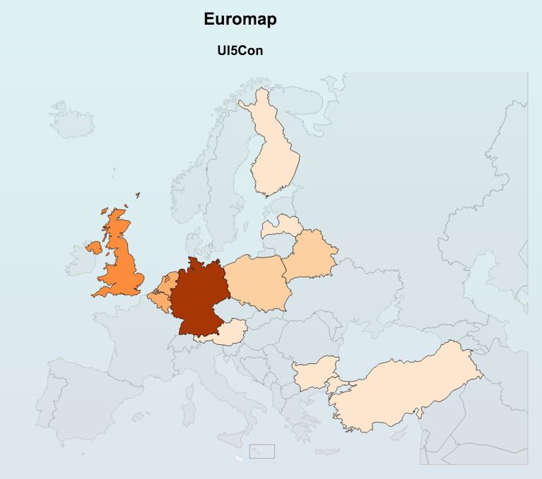

# UI5 Map Control
## Introduction
This control is displays a map (or any other svg file) and colorizes it's content. In the case of a map you would
like to colorize the countries according to values in the bound datasource / datamodel.  
To give an idea of what you can expect have a look at the following graphic.  


In this graphic some countries are colorized. The colors are selected from a color palette during runtime.

## Usage
The following code snippet shows you how to use this control in your applications. I marked the interesting lines with a greater sign.

```
<mvc:View
	controllerName="de.tammenit.svg.ui5con.controller.Object"
	xmlns="sap.m"
	xmlns:mvc="sap.ui.core.mvc"
	xmlns:semantic="sap.m.semantic"
1>	xmlns:em="de.tammenit.controls.svg"
	xmlns:core="sap.ui.core"
	xmlns:app="http://schemas.sap.com/sapui5/extension/sap.ui.core.CustomData/1"
	xmlns:footerbar="sap.ushell.ui.footerbar">

	<semantic:FullscreenPage
		id="page"
		navButtonPress="onNavBack"
		showNavButton="true"
		title="{i18n>objectTitle}"
		busy="{objectView>/busy}"
		busyIndicatorDelay="{objectView>/delay}">

		<semantic:content>
2>			<em:Map id="euromap"
				title="Euromap"
				subTitle="UI5Con"
				colorpalette="Oranges"
				colorChangeValues="0, 1, 2, 3, 5, 10, 20, 50"
				svgFileName="svg/europemap.svg"
				codePropertyName="code"
				quantityPropertyName="quantity"
				descriptionPropertyName="name"
				standardFillColor="#CDCDCD"
				tooltipText1=""
				tooltipText2=" people from "
				tooltipText3=" are with us."
				data="{path: '/Attendees'}"
			>
3>				<em:data>
					<core:Element></core:Element>
				</em:data>
			</em:Map>
 		</semantic:content>

	</semantic:FullscreenPage>

</mvc:View>
```
### 1>
Insert the namespace for the control. This is always  
`de.tammenit.controls.svg`  

### 2>
Add the control to the page or any control. The name of the control in `Map`. The properties are described in detail in the API help (TBD).  
The most important properties are listed here:    
* `data`: This defines the binding to the entityset of the model the control is using.
The controls entityset has to have at least three properties.
	* `codePropertyName`: This is the technical property that is used for resolving the DOM node in the SVG file. For each entity of the entityset the value of this property is used to retrieve the according DOM node.  
	e.g.:  
	```
	<path
		 id="gb"
		 class="eu europe"
		 d="M 203.55368,395.07058 C 205.23859,396.38106 206.64268,397.12991 206.45547,383.27618 z "/>
	```
	In this example the id of the SVG path is `gb` (for Great Britain). In you entityset there must be an entity which `codePropertyName` value is also `gb`.
	* `quantityPropertyName`: This is a numeric quantity value that is used for colorizing the svg path that was found for the `codePropertyName` value. The higher the value the darker the color of this path.
	* `descriptionPropertyName`: This value is used for generating a tooltip for the svg path.
* `colorpalette`: This property defines the color palette from the `colorbrewer.js` file that is used. Have a look into the file to see which palettes are available.
* `colorChangeValues`: This property defines at which value of `quantityPropertyName` the color changes to the next value of the `colorpalette`.
* `svgFileName`: This property defines the name of the SVG file. You can use any SVG file you like with this control, even files that don't display a map. It's only important that the file contains `ìd`s that match to the entities in the entityset.
* `other properties`: These properties are described later.

### 3>
For the `data` property a `<data>` tag as child of the control must be defined. This acts as template for the aggregation `data`.   
The template control can be a `<core:Element>` and is allowed to be empty cause it is not really used by the control itself. UI5 just requires a template for aggregation binding.

## Installation
To install the control use either [Bower](http://bower.io) (recommended way) or follow the instructions below.

### Bower Installation  
This control is registered at Bower. Bower is a component management system that allows you to install, manage, update and ... components/controls from a central place. It is assumed that node.js and Bower are already installed on your PC.  
* Open a terminal window and move to your project directory.
`cd myProject`
* Enter `bower install ui5-ctrl-svg-map`. This installs the component into the folder `bower_components`.
* Either
	* copy the file `bower_components/ui5-ctrl-svg-map/control/svg/europemap.svg` into any folder under `webapps`, e.g. `webapps/svg`
	* or leave the file where it is and change the setting of the control property `svgFileName`(see above).
* Add the `colorbrewer.js` to the resources of your projects `manifest.json`
	```
	"sap.ui5": {
		...
		...
		"resources": {
			"js": [
				{
					"uri": "bower_components/ui5-ctrl-svg-map/control/js/colorbrewer.js"
				}
			]
		},
	```
* Register a module path for the Map control to the resourceroots section of you manifest.json file.
	```
	"sap.ui5": {
		...
		"resourceRoots": {
			"de.tammenit.controls.svg": "bower_components/ui5-ctrl-svg-map/control"
		},
	```

Alternatively you can register the modulepath in the `init` method of your `Component.js` file.
	```
	// Register the module path for the svg control
	var modulePath = jQuery.sap.getModulePath(this.getManifestObject().getComponentName());
	jQuery.sap.registerModulePath("de.tammenit.controls.svg", modulePath + "/bower_components/ui5-ctrl-svg-map/control");
	```

#### Hint when using WebIDE
Cause there is currently no WebIDE plugin for Bower (the community is working on it) we recommend the following workflow if you develop with SAP WebIDE.
* Commit your changes in WebIDE and push them to your Git.
* Clone the repository to your local PC.
* Install the component like described above.
* Commit and Push the changes to your repository.
* Pull the changes into your WebIDE workspace.
* Keep on working in WebIDE.  

### Manual Installation
When using the manual Installation you have to process the following steps.
* Copy the file `Map.js` into any folder of your UI5 project, e.g. `webapps/controls/svg`
* Copy the file `svg/europemap.svg` into any folder under `webapps`, e.g. `webapps/svg`
* Copy the file `colorbrewer.js` into any folder under `webapps`, e.g. `webapps/js`
* Add the `colorbrewer.js` to the resources of your projects `manifest.json`
```
"sap.ui5": {
	...
	...
	"resources": {
		"js": [
			{
				"uri": "js/colorbrewer.js"
			}
		]
	},
```
* Register a module path for the Map control in the `init` method of your `Component.js` file.
```
// Register the module path for the svg control
var modulePath = jQuery.sap.getModulePath(this.getManifestObject().getComponentName());
jQuery.sap.registerModulePath("de.tammenit.controls.svg", modulePath + "/controls/svg");
```
